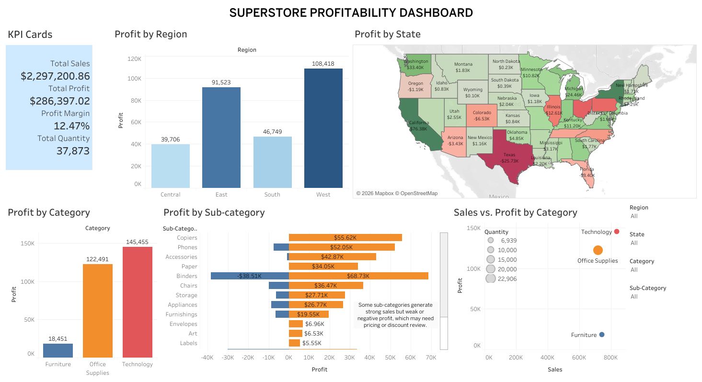

# Superstore Profitability Analysis

## Project Overview
This project analyzes the Sample Superstore dataset to identify sales, profit, and product performance trends using Tableau.

## Business Questions
- Which regions are most and least profitable?
- Which States are most and least profitable
- Which categories and sub-categories drive profit or losses?
- Are high sales always leading to high profit?

## Tools Used
- Tableau
- Python / Jupyter Notebook
- CSV
- GitHub

## Dataset
The cleaned dataset is included in the `/data` folder.

## Dashboard Preview

## Key Insights
- Some sub-categories generate sales but still produce losses.
- Profit performance varies across regions and categories.
- Profit performance is uneven across states and sub-categories, indicating opportunities to optimize inventory, pricing, and sales focus in underperforming areas.

## Files Included
- `data/cleaned_superstore.csv`
- `data/SampleSuperstore.csv`
- `scripts/superstore_eda.ipynb`
- `tableau/superstore_dashboard.twbx`
- `images/superstore_dashboard.png`

## Tableau Dashboard
[Tableau Public link](https://public.tableau.com/app/profile/nicanor.jr.peril/viz/superstore_dashboard_17801723786540/SuperstoreDashboard?publish=yes)